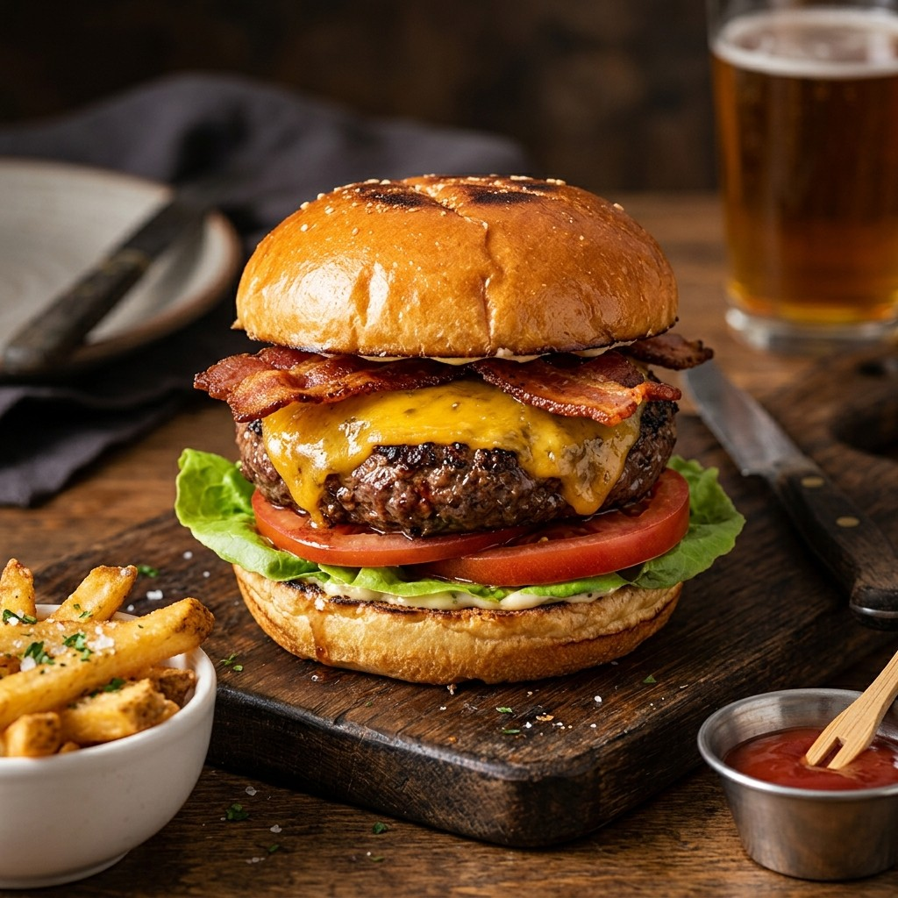

# TasteHub – Restaurant Menu & Shopping Cart

**TasteHub** is a modern, responsive, high-performance web application built with pure **HTML5, Vanilla CSS3, and Vanilla JavaScript**. It allows users to browse food categories, search for dishes in real-time, filter by dietary preference (Veg / Non-Veg), dynamically add dishes to a persistent shopping cart, and complete simulated checkouts.

Designed with a sleek aesthetic, glassmorphism badges, micro-animations, and clean modular code, TasteHub serves as an outstanding **college portfolio project** and web development showcase.

---

## 🌟 Key Features

- 📱 **Fully Responsive Layout**: Designed for seamless operation across desktop (4 columns), tablet (2 columns), and mobile (1 column) devices.
- 🍔 **Dynamic Category Filtering**: Instant filtering for *Starters*, *Main Course*, *Pizza*, *Burgers*, *Desserts*, and *Drinks*.
- 🔍 **Real-Time Live Search**: Instant search by food name, description, or category with an interactive empty-state message.
- 🥬 **Dietary Filter**: Quick toggles to switch between Veg and Non-Veg menu options.
- 🛒 **Interactive Slide-In Cart**:
  - Add items to cart with smooth animations.
  - Increment/decrement item quantity or remove items directly.
  - Dynamic subtotal, 5% tax, and total calculation.
  - Cart counter badge on the header navigation with bump animation.
- 💾 **LocalStorage Persistence**: Cart items remain saved even after refreshing or closing the browser.
- 💳 **Simulated Checkout**: Custom modal confirmation popping up on checkout and clearing the cart state.
- 📧 **Contact Form Validation**: Form validation with real-time feedback and toast notifications.
- 🎨 **Modern Design System**: Built with CSS variables, custom typography (`Outfit` & `Inter`), subtle shadows, hover effects, sticky glassmorphism header, and smooth scroll navigation.

---

## 🛠️ Technologies Used

- **HTML5**: Semantic structure (`<header>`, `<nav>`, `<section>`, `<aside>`, `<footer>`, `<form>`).
- **CSS3**: Custom properties (CSS variables), Flexbox, CSS Grid, media queries, CSS keyframe animations, and glassmorphism styling.
- **Vanilla JavaScript (ES6+)**:
  - Higher-order functions (`map()`, `filter()`, `find()`, `reduce()`).
  - Event listeners & DOM manipulation.
  - Template literals for dynamic HTML rendering.
  - Browser `localStorage` API for state persistence.
- **Font Awesome 6**: Vector icons for cart, rating, search, veg indicators, and social links.
- **Google Fonts**: `Outfit` for bold headings and `Inter` for clean body typography.

---

## 📂 Project Structure

```text
tastehub-restaurant/
│
├── index.html              # Main HTML markup & semantic application layout
│
├── css/
│   └── style.css           # Global design system, variables, layouts & responsive queries
│
├── js/
│   ├── data.js             # 18 Realistic food menu objects with categories & details
│   └── script.js           # Core JS application logic (render, cart, search, localStorage)
│
├── assets/                 # High-resolution food photography & brand assets
│   ├── logo.png
│   ├── pizza.jpg
│   ├── burger.jpg
│   ├── pasta.jpg
│   ├── biryani.jpg
│   ├── sandwich.jpg
│   ├── dessert.jpg
│   ├── drinks.jpg
│   ├── starters.jpg
│   └── about.jpg
│
└── README.md               # Complete project documentation & guide
```

---

## 🚀 How to Run

Since TasteHub is built strictly with frontend technologies without build tools or node servers, running it is effortless:

1. **Clone or Download** this repository folder to your local machine.
2. Open the folder: `tastehub-restaurant` or workspace root directory.
3. **Double click on `index.html`** to open it directly in any modern web browser (Chrome, Edge, Firefox, Safari).
4. Alternatively, if using VS Code, right-click `index.html` and select **"Open with Live Server"**.

---

## 📸 Screenshots

*(Add screenshots of your TasteHub application here for your portfolio)*

| Desktop View | Mobile Cart Drawer |
|--------------|--------------------|
|  |  |

---

## 🔮 Future Improvements

1. 💳 **Payment Gateway Integration**: Integrate Stripe or Razorpay API for live payment processing.
2. 👤 **User Authentication**: Add user login & registration to save order history and addresses.
3. 🚚 **Live Order Tracking**: Interactive map step-tracker showing food preparation & delivery status.
4. 🌙 **Dark Mode Toggle**: Built-in CSS custom property theme switcher for dark theme enthusiasts.
5. 🏷️ **Promo Code System**: Coupon code input box applying discounts to cart total.

---

## 📚 Important Technical Concepts for Interviews

When presenting this project in an interview, be prepared to explain the following key concepts:

1. **DOM Manipulation & Dynamic Rendering**:
   - Menu items and cart contents are rendered dynamically using JavaScript template literals (`${...}`) inserted via `element.innerHTML`. This keeps HTML clean and decouples data from presentation.

2. **Array Method Chain**:
   - `filter()` is used for searching food items by category and name.
   - `find()` retrieves specific food objects by `id` during cart operations.
   - `map()` transforms food arrays into HTML string representations.
   - `reduce()` calculates cart badge totals and order amounts dynamically.

3. **State Management & Data Flow**:
   - The application maintains a single source of truth (`cart` array). Whenever an action (add, remove, quantity change) mutates `cart`, `saveCart()` and `updateCart()` are invoked to keep UI and storage in sync.

4. **LocalStorage API**:
   - `localStorage.setItem('tastehub_cart', JSON.stringify(cart))` serializes JS objects to JSON strings for persistent browser storage.
   - `localStorage.getItem('tastehub_cart')` deserializes the string back into JS arrays upon initialization using `JSON.parse()`.

5. **Responsive Layout Strategy**:
   - Implemented using mobile-first/desktop CSS Grid (`grid-template-columns: repeat(4, 1fr)`) with media queries (`@media (max-width: 1024px)` for 2 columns, `@media (max-width: 768px)` for 1 column).
